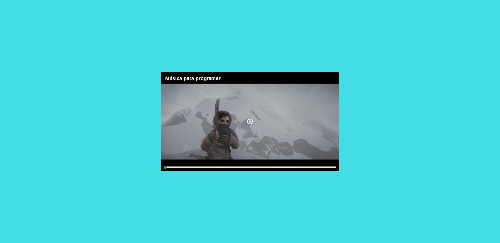
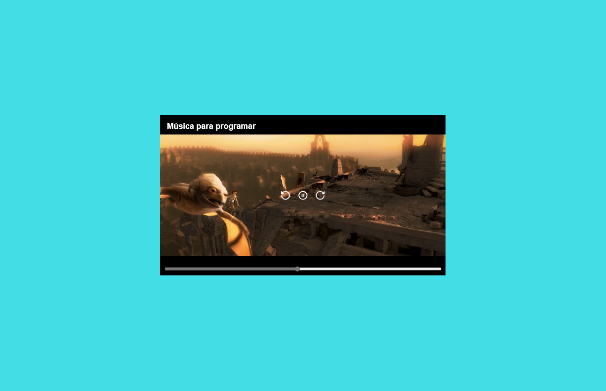
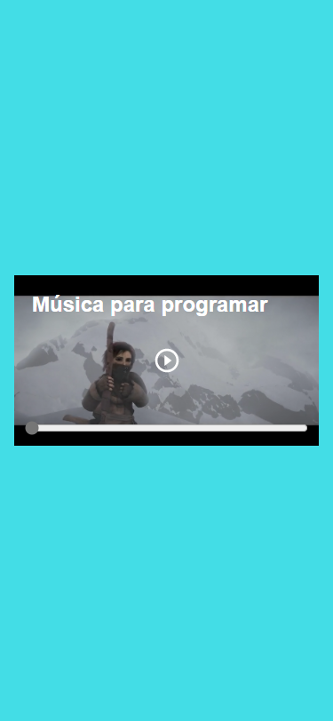

# Curso de introduccíon al desarrollo web

Este proyecto es parte del **Curso de introduccíon al desarrollo web** de 
 [leonidasesteban.com](https://leonidasesteban.com/aprender/desarrollo-web)

Se creo un reproductor de video personalizado a medida que se iba aprendiendo en el curso🙂.

### Demo :computer:

Has click en el enlace para ver el  **[resultado](https://cesarchoqueskater.github.io/video-player/)** 

### Imagenes :camera:

